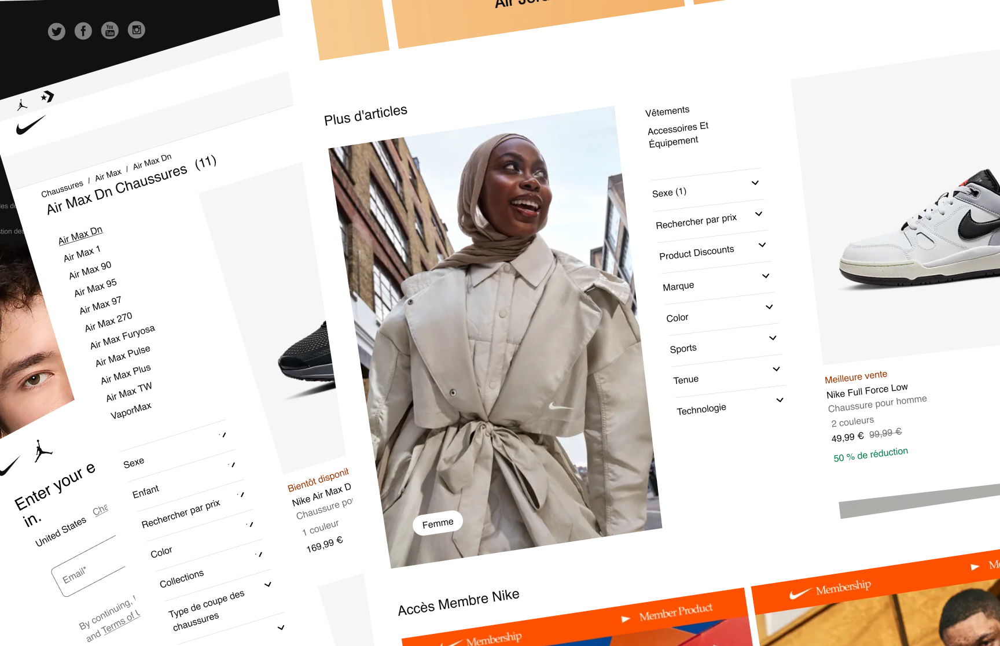
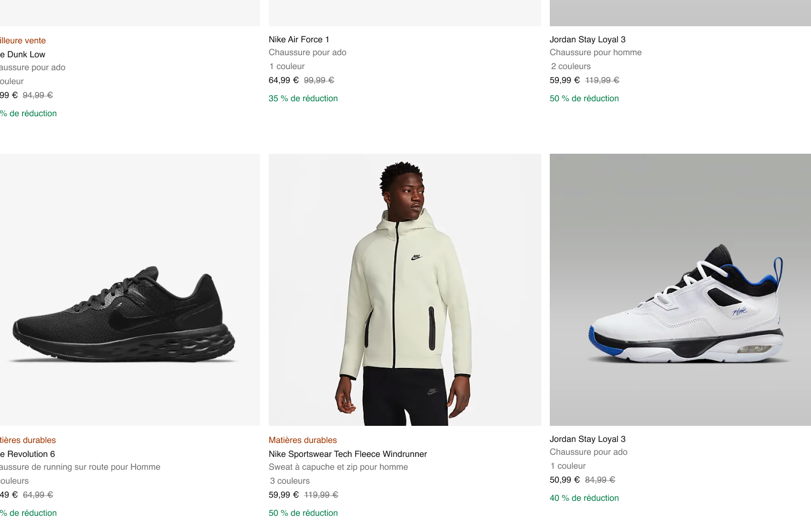

# 👟 Nike-Clone - An eCommerce Website Clone

### Author Links

👋 Hello, I'm Hordofel Dusty BAMANA.

👇 Follow Me:

- [Twitter](https://twitter.com/hordofel)
- [LinkedIn](https://www.linkedin.com/in/dusty-hordofel-bamana-08389310a)

---

## Demo

## 

### 🚀 Description

---

Welcome to the captivating world of Nike-Clone, where performance and style converge to create an unparalleled experience in fashion and sports innovation. This e-commerce website, beautifully designed by Dusty Hordofel, opens the doors to a haven for sports enthusiasts, passionate athletes, and urban fashion aficionados.

Discover an extensive selection of products that embody the bold spirit and relentless pursuit of excellence, thanks to the talent of Dusty Hordofel. Browse through our diverse range of iconic shoes, from the legendary Air Max to cutting-edge running shoes, engineered to propel your performance to new heights. Our collection of sportswear and streetwear seamlessly blends comfort and style, allowing you to express yourself while staying on the cutting edge of trends.

At Nike-Clone, innovation is our driving force. Explore our cutting-edge technologies, such as React foam for responsive cushioning, or Dri-FIT fabric that wicks away sweat to keep you cool and dry during your most intense workouts. Each product we offer, crafted through Dusty Hordofel's creativity, is the result of meticulous research and a commitment to excellence.

This e-commerce website is more than just a showcase of products. It embodies a lifestyle, showcasing Dusty Hordofel's exceptional skills in web and mobile development. By choosing this website, you embark on a seamless and inspiring online experience, where each click reveals Dusty Hordofel's expertise. You become part of a community that values authenticity, performance, and positive impact.

Navigate through this exceptional website, passionately created by Dusty Hordofel, and discover a unique online shopping experience. Dusty Hordofel and his expertise accompany you every step of the way on this e-commerce journey.

Join us today and embrace the power of the "Swoosh." Welcome to the exciting world of Nike-Clone, reimagined by Dusty Hordofel, where sports meet style and every interaction is a celebration of exceptional skills.

Just Do It™.

Dusty Hordofel
Creator and Web & Mobile Developer

---

## Section 1: Folder Structure

### 1. Define a project folder structure

- create `Nike` Project Using [Nextjs](https://nextjs.org/docs/getting-started/installation) with `App Router`

```bash
$ npx create-next-app@latest
```

✅ What is your project named? Nike-Clone <br/>
Would you like to use TypeScript? No / **Yes** <br/>
✅ Would you like to use ESLint? No / **Yes** <br/>
✅ Would you like to use Tailwind CSS? No / **Yes** <br/>
✅ Would you like to use `src/` directory? No / **Yes** <br/>
✅ Would you like to use App Router? (recommended) No / **Yes** <br/>
✅ Would you like to customize the default import alias? No / **Yes** <br/>
✅ What import alias would you like configured? **@/\***

### 2. Shadcn

- add [Shadcn](https://ui.shadcn.com/docs/installation/next) and [Button](https://ui.shadcn.com/docs/components/button)

```bash
$ npx shadcn-ui@latest init
$ npx shadcn-ui@latest add button
```

### 3. Storybook

- add [Storybook](https://storybook.js.org/docs/get-started/nextjs) and `run it`

```bash
$ npx storybook@latest init
$ npm run storybook
```

### 4. Playwright and testing-library

- add [Playwright](https://playwright.dev/docs/intro) and run [example test](tests/example.spec.ts)

```bash
$ npm init playwright@latest
$ npx playwright test
```

- add [testing-library](https://nextjs.org/docs/pages/building-your-application/testing/jest)

```bash
$ npm install -D jest jest-environment-jsdom @testing-library/react @testing-library/jest-dom
$ npm init jest@latest
$ npm i --save-dev @types/jest
$ npm i -D ts-node
```

- configure [jest.config.ts](jest.config.ts)

```ts
import type { Config } from "jest";
import nextJest from "next/jest.js";

const createJestConfig = nextJest({
  // Provide the path to your Next.js app to load next.config.js and .env files in your test environment
  dir: "./",
});

// Add any custom config to be passed to Jest
const config: Config = {
  coverageProvider: "v8",
  testEnvironment: "jsdom",
  // Add more setup options before each test is run
  testMatch: ["**/__tests__/**/*.test.ts", "**/__tests__/**/*.test.tsx"],
  setupFilesAfterEnv: ["<rootDir>/jest.setup.ts"],
};

// createJestConfig is exported this way to ensure that next/jest can load the Next.js config which is async
export default createJestConfig(config);
```

- add [jest.setup.ts](jest.setup.ts)

```ts
// Learn more: https://github.com/testing-library/jest-dom
import "@testing-library/jest-dom";
```

- add a test to check if the <Home /> component [successfully renders a heading](__tests__/home.test.tsx)

```tsx
import Link from "next/link";

export default function Home() {
  return (
    <div>
      <h1>Home</h1>
      <Link href="/about">About</Link>
    </div>
  );
}
```

```tsx
import Home from "@/app/page";
import "@testing-library/jest-dom";
import { render, screen } from "@testing-library/react";

describe("Home", () => {
  it("renders a heading", () => {
    render(<Home />);

    const heading = screen.getByRole("heading", { level: 1 });

    expect(heading).toBeInTheDocument();
  });
});
```

- run test `npm run test`

```bash
> nike@0.1.0 test
> jest

PASS **tests**/home.test.tsx
Home
✓ renders a heading (34 ms)

Test Suites: 1 passed, 1 total
Tests: 1 passed, 1 total
Snapshots: 0 total
Time: 0.751 s
Ran all test suites.
```

## Section 2: Components

### 5. Nike Colors and Fonts

- add [Nike Colors](tailwind.config.ts)
- add [Helvetica font](src/assets/fonts/helvetica/helvetica.ts)
- add [nike font](src/assets/fonts/nike/nike.ts)

### 6. Buttons

- create [ArrowButton](src/components/ui/buttons/arrow-button/arrow-button.tsx)
- create [Button](src/components/ui/buttons/button/button.tsx)

### 7. Banner variants


- create [Banner](src/components/ui/banner/Banner.tsx)

```tsx
import Link from "next/link";
import React from "react";
import BannerContent from "./BannerContent";
import { cn } from "@/lib/utils";
import BannerVideo from "./BannerVideo";
import BannerImage from "./BannerImage";

export type ImageProps = {
  mediaType: "image";
  className?: string;
} & React.ImgHTMLAttributes<HTMLImageElement>;

export type VideoProps = {
  mediaType: "video";
  className?: string;
} & React.VideoHTMLAttributes<HTMLVideoElement>;

export type NoMediaProps = {
  mediaType: "none";
};

export type CommonBannerProps = {
  href: string;
  title?: string;
  description?: string;
  links?: { label: string; href: string }[];
  descriptionClassName?: string;
  titleClassName?: string;
  bannerClassName?: string;
  contentPosition?: string;
  textAlign?: "text-start" | "text-center" | "text-end";
  linksAlign?: string;
  linksVariant?: "primary" | "secondary";
  linksSize?: "small" | "medium" | "large";
};

type BannerProps = CommonBannerProps & (ImageProps | VideoProps | NoMediaProps);

const Banner: React.FC<BannerProps> = (props) => {
  const hasContent =
    props.title ||
    (props.title && props.description) ||
    (props.title && props.description && props.links);

  return (
    <figure
      className={cn(
        "relative text-white h-full max-h-[518px]",
        props.bannerClassName
      )}
    >
      {props.mediaType === "image" ? (
        <Link href={props.href}>
          <BannerImage {...(props as ImageProps)} />
        </Link>
      ) : props.mediaType === "video" ? (
        <Link href={props.href}>
          <BannerVideo {...(props as VideoProps)} />
        </Link>
      ) : null}
      {hasContent && (
        <BannerContent
          {...(props as Omit<CommonBannerProps, "href" | "bannerClassName">)}
        />
      )}
    </figure>
  );
};

export default Banner;
```

- [BannerVideo](src/components/ui/banner/BannerVideo.tsx)

```tsx
import React from "react";
import { VideoProps } from "./Banner";
import { cn } from "@/lib/utils";

type BannerVideo = Omit<VideoProps, "mediaType">;

const BannerVideo = ({
  src,
  poster,
  autoPlay = true,
  loop = true,
  muted = true,
  controls = false,
  className,
  ...videoProps
}: BannerVideo) => {
  return (
    <video
      className={cn("max-h-[518px] w-full h-full  object-cover", className)}
      src={src}
      poster={poster}
      autoPlay={autoPlay}
      loop={loop}
      muted={muted}
      controls={controls}
      {...videoProps}
    />
  );
};

export default BannerVideo;
```

- [BannerImage](src/components/ui/banner/BannerImage.tsx)

```tsx
import React from "react";
import { ImageProps } from "./Banner";
import { cn } from "@/lib/utils";

type BannerImageProps = Omit<ImageProps, "mediaType">;

const BannerImage = ({
  src,
  alt,
  className,
  ...imgProps
}: BannerImageProps) => {
  return (
    <picture>
      
    </picture>
  );
};

export default BannerImage;
```

- [buttonLinks](src/components/ui/buttons/button-links/buttonLinks.tsx)

```tsx
import Link from "next/link";
import { buttonVariants } from "./buttons/button/button";
import { cn } from "@/lib/utils";

type ButtonLinkListProps = {
  links?: { label: string; href: string }[];
  variant?: "primary" | "secondary";
  size?: "small" | "medium" | "large";
  linksAlign?: string;
};

const buttonLinks = ({
  links,
  variant = "primary",
  size = "small",
  linksAlign = "justify-start",
}: ButtonLinkListProps) => {
  return (
    <div className={cn("flex items-center mt-[18px]", linksAlign)}>
      {links?.map((link, index) => (
        <Link
          key={index}
          href={link.href}
          data-button-type="button"
          aria-label={link.label}
          className={cn(buttonVariants({ variant, size }), "font-medium")}
        >
          {link.label}
        </Link>
      ))}
    </div>
  );
};

export default buttonLinks;
```

- [using Banner](src/app/page.tsx)

```tsx
  <SmallDiscountBanner
        mediaType="image"
        src="https://static.nike.com/a/images/f_auto/dpr_2.0,cs_srgb/w_1512,c_limit/340cfca0-c6d2-4748-ac2b-aa77dcfe44ad/nike-just-do-it.png"
        title="-25% sur tout le site"
        alt="Molongui"
        href="https://www.nike.com/fr/w/promotions-9dklk"
        contentPosition="absolute-center text-black-200 w-[90%]"
        titleClassName="text-2xl sm:text-3xl  md:text-[40px] min-[960px]:text-5xl"
        bannerClassName="h-[104px] bg-orange"
      />
      <DiscountBanner
        {...discountedItems}
        mediaType="image"
        contentPosition="absolute-center text-black-200 w-[90%]"
        titleClassName="text-2xl sm:text-3xl md:text-[40px] min-[960px]:text-5xl"
        bannerClassName="h-[250px]"
      />
      <DiscoverBanner
        mediaType="none"
        contentPosition="absolute-center w-[90%]"
        titleClassName="text-2xl sm:text-4xl md:text-5xl lg:text-6xl xl:text-7xl text-black-200 px-10"
        bannerClassName="h-[300px]"
        linksAlign="justify-center"
        {...discoverItems}
      />
      <ImageBanner
        mediaType="image"
        contentPosition="absolute-center w-[80%]"
        textAlign="text-center"
        titleClassName="text-3xl sm:text-4xl md:text-5xl lg:text-7xl  text-white"
        bannerClassName="h-[518px]"
        descriptionClassName="text-white"
        {...bannerImage}
      />
      <VideoBanner
        mediaType="video"
        contentPosition="bottom-left w-[80%]"
        textAlign="text-start"
        linksAlign="justify-start"
        linksVariant="secondary"
        titleClassName="text-3xl sm:text-4xl md:text-5xl lg:text-7xl text-white"
        descriptionClassName="text-white"
        bannerClassName="h-[518px]"
        {...bannerVideo}
      />
```

### 8. Carousel

- create [Carousel](src/components/ui/carousels/Carousel.tsx)

```ts
"use client";
import React, { useEffect, useRef, useState } from "react";
import CarouselControls from "./CarouselControls";
import CarouselSlides from "./CarouselSlides";
import { TrendSlidesProps } from "@/types/types";

interface CarousselProps {
  title?: string;
  data?: TrendSlidesProps[];
  slideClassName?: string;
  imageClassName?: string;
  carouselClassName?: string;
  children: (slide: TrendSlidesProps) => React.ReactNode; //
}

const Carousel = ({
  title,
  data,
  imageClassName,
  slideClassName,
  carouselClassName,

  children,
}: CarousselProps) => {
  const [activeIndex, setActiveIndex] = useState(0);
  const [isAtStart, setIsAtStart] = useState(true);
  const [isAtEnd, setIsAtEnd] = useState(false);

  const carouselRef = useRef<HTMLUListElement | null>(null);

  const goToPreviousSlide = () => {
    if (carouselRef.current) {
      carouselRef.current.scrollBy({
        left: -469,
        behavior: "smooth",
      });
    }
  };

  const goToNextSlide = () => {
    if (carouselRef.current) {
      carouselRef.current.scrollBy({
        left: 469, //457+12(slide width + margin right)
        behavior: "smooth",
      });
    }
  };

  const handleScroll = () => {
    if (carouselRef.current) {
      const scrollLeft = carouselRef.current.scrollLeft;
      const maxScrollLeft =
        carouselRef.current.scrollWidth - carouselRef.current.clientWidth;
      const active = Math.round(scrollLeft / 469);
      setActiveIndex(active);
      setIsAtStart(scrollLeft === 0);
      setIsAtEnd(scrollLeft >= maxScrollLeft);
    }
  };

  useEffect(() => {
    const carousel = carouselRef.current;
    if (carousel) {
      carousel.addEventListener("scroll", handleScroll);
      return () => {
        carousel.removeEventListener("scroll", handleScroll);
      };
    }
  }, []);

  return (
    <section>
      <div className="flex justify-between items-center px-12 mb-3 pt-[2px] h-[56.398px]">
        <h2 className="text-2xl font-medium ">{title}</h2>
        <CarouselControls
          isAtStart={isAtStart}
          isAtEnd={isAtEnd}
          goToPreviousSlide={goToPreviousSlide}
          goToNextSlide={goToNextSlide}
        />
      </div>
      <CarouselSlides
        carouselRef={carouselRef}
        data={data}
        slideClassName={slideClassName}
        imageClassName={imageClassName}
        carouselClassName={carouselClassName}
      >
        {children}
      </CarouselSlides>
    </section>
  );
};

export default Carousel;
```

### 9. Navigation (Part1)

- create [Navbar](src/components/navbar/Navbar.tsx)

```tsx
"use client";
import { CartIcon, FavorisIcon, NikeIcon } from "@/assets/icons";
import React, { useState } from "react";
import SearchInput from "./search/SearchInput";
import NavLinks from "./navigation/NavLinks";
import { menuLinks } from "@/assets/data/menuLinks";
import Link from "next/link";

const Navbar = () => {
  const [expand, setExpand] = useState(false);

  return (
    <header className="relative z-10 max-w-[1920px] h-16 bg-white">
      <div className="grid grid-cols-12 px-12 h-full items-center overflow-hidden">
        <div className="col-span-2 h-full z-10">
          <span className="sr-only">Page d&lsquo;accueil Nike</span>
          <NikeIcon className="cursor-pointer hover:opacity-70 w-[60px] h-[60px]  scale-125 " />
        </div>

        <div className="col-span-7 h-full">
          <nav className="absolute inset-x-0 h-full ">
            <NavLinks menuLinks={menuLinks} />
          </nav>
        </div>
        <div className="col-span-3 h-full z-10 pt-3">
          <div className="float-right gap-1 flex h-[36px]">
            <search aria-label="Rechercher des articles Nikes">
              <SearchInput />
            </search>

            {!expand && (
              <>
                <Link className="link-icon-hover" href="#">
                  <FavorisIcon aria-label="Favoris" />
                </Link>
                <Link className="link-icon-hover" href="#">
                  <CartIcon aria-label="Articles du panier: 0" />
                </Link>
              </>
            )}
          </div>
        </div>
      </div>
    </header>
  );
};

export default Navbar;
```

### 10. Product Card

## 

- create [productCard](src/components/products/productCard/ProductCard.tsx)

```tsx
"use client";
import Link from "next/link";
import React, { useEffect, useState } from "react";
import { IProduct } from "@/models/Product";
import ProductCardImage from "./ProductCardImage";
import ProductCardPrice from "./ProductCardPrice";
import ProductCardColor from "./ProductCardColor";
import ProductCardDescription from "./ProductCardDescription";

const ProductCard = ({ product }: { product: IProduct }) => {
  const { name, subProducts, slug } = product;

  const [active, setActive] = useState(0);
  const [images, setImages] = useState(subProducts[active]?.images);
  const [prices, setPrices] = useState(
    subProducts[active]?.sizes
      .map((s) => {
        return s.price;
      })
      .sort((a, b) => {
        return a - b;
      })
  );

  const [productColors, setProductColors] = useState(
    subProducts.map((p) => {
      return p.color;
    })
  );

  const bestSeller = true;
  const newRelease = false;

  useEffect(() => {
    setImages(subProducts[active].images);
    setPrices(
      subProducts[active]?.sizes
        .map((s) => {
          return s.price;
        })
        .sort((a, b) => {
          return a - b;
        })
    );
  }, [active, product, subProducts]);

  return (
    <figure>
      <Link
        className="sr-only"
        data-testid="product-card-link"
        href={`/products/${slug}?style=${active}`}
        tabIndex={0}
      >
        {name}
      </Link>
      <Link
        aria-label={name}
        className="product-card-link group"
        href={`/products/${slug}?style=${active}`}
      >
        <ProductCardImage images={images} name={name} active={active} />
        <div className="product-card-info pt-3 pb-[2px]">
          <ProductCardColor
            productColors={productColors}
            subProducts={subProducts}
            setImages={setImages}
            setActive={setActive}
          />

          <ProductCardDescription
            name={name}
            productColors={productColors}
            bestSeller={bestSeller}
            newRelease={newRelease}
          />
          <ProductCardPrice
            prices={prices}
            subProducts={subProducts}
            active={active}
          />
        </div>
      </Link>
    </figure>
  );
};

export default ProductCard;
```

### 11. Product Détails

- create [ProductInformation](src/components/product/ProductInformation.tsx)
- create [ProductImages](src/components/product/ProductImages.tsx)

### 12. Redux Toolkit

- install [redux toolkit ](https://redux-toolkit.js.org/introduction/getting-started) and [redux persist](https://redux-toolkit.js.org/rtk-query/usage/persistence-and-rehydration)

```bash
$ npm install react-redux @reduxjs/toolkit redux-persist redux-devtools-extension
```

- create [ cart Slice](src/store/cartSlice.ts)
- create a [store](src/store/index.ts)

```bash
$ npm i react-hook-form @hookform/resolvers zod
```

### 13. Authentification Form Phase 1

### 14. Authentification Form Phase 2

### 15. Register Form Phase 1

### 16. CartSchema, subCategorySchema, categorySchema and OrderSchema

#### 17. Add Cart to the database

```ts
"use server";

import connectDB from "@/config/database";
import { currentUser } from "@/utils/auth";
import User from "@/models/User";
import mongoose from "mongoose";
import Cart from "@/models/Cart";
import Product, { IProduct } from "@/models/Product";
import { CartItem } from "@/store/cartSlice";

// Fonction utilitaire pour vérifier l'ObjectId valide
const isValidObjectId = (id: string): boolean => {
  return mongoose.Types.ObjectId.isValid(id);
};

// Fonction pour sauvegarder les articles du panier
export async function saveCartItems(cartItems: CartItem[]) {
  try {
    // Récupérer l'utilisateur actuel
    const user = await currentUser();
    if (!user || typeof user._id !== "string" || !isValidObjectId(user._id)) {
      return { error: "Unauthorized" };
    }

    // Connexion à la base de données
    connectDB();

    // Récupérer l'utilisateur depuis la base de données
    const dbUser = await User.findOne({ email: user.email });
    if (!dbUser) {
      return { error: "Unauthorized" };
    }

    // Construire le tableau de produits pour le panier
    const products = await Promise.all(
      cartItems.map(async (cartItem) => {
        const dbProduct = (await Product.findById(
          cartItem.productID
        )) as IProduct;
        if (!dbProduct) {
          throw new Error(`Product with ID ${cartItem.productID} not found`);
        }

        const subProduct = dbProduct.subProducts[Number(cartItem.style)];
        if (!subProduct) {
          throw new Error(
            `SubProduct with style ${cartItem.style} not found for product ${dbProduct.name}`
          );
        }

        // Trouver la taille du produit correspondant dans les sous-produits
        const productSize = subProduct.sizes.find(
          (p) => p.size === cartItem.size
        );

        // Vérifier que la taille du produit a été trouvée et que son prix est défini
        if (!productSize || typeof productSize.price !== "number") {
          throw new Error(
            `Price for size ${cartItem.size} not found in subProduct`
          );
        }

        // Calculer le prix en tenant compte de la remise
        const discountedPrice =
          subProduct.discount > 0
            ? Number(
                (
                  productSize.price -
                  productSize.price / subProduct.discount
                ).toFixed(2)
              )
            : Number(productSize.price.toFixed(2));

        // Construire l'objet représentant le produit du panier
        const cartProduct = {
          name: dbProduct.name,
          product: dbProduct._id,
          color: {
            color: cartItem.color,
            image: cartItem.image,
          },
          image: subProduct.images[0].url,
          quantity: Number(cartItem.quantity),
          size: cartItem.size,
          price: discountedPrice,
        };

        return cartProduct;
      })
    );

    // Calculer le total du panier
    const cartTotal = products.reduce((total, product) => {
      return total + product.price * product.quantity;
    }, 0);

    // Supprimer le panier existant s'il y en a un
    const existingCart = await Cart.findOneAndDelete({ user: user._id });

    // Créer un nouveau panier
    await new Cart({
      products,
      cartTotal: cartTotal.toFixed(2),
      user: user._id,
    }).save();

    console.log("CART AMOUNT", {
      products,
      cartTotal: cartTotal.toFixed(2),
      user: user._id,
    });

    return { success: "Cart items saved successfully!" };
  } catch (error) {
    console.error("Error saving cart items:", error);
    return { error: "An error occurred while saving cart items" };
  }
}
```

### 18. Coupon

### 19. Checkout Part 2

### 20. Checkout Part 3

### 21. Checkout Part 4

### 22. ShippingAdress

### 23. Delivery Address

### 24. Clean actions

### 25.Handle different section

### 26. Cookie Phase 1

### 27. Payment Method

````tsx
Les deux morceaux de code que vous avez présentés vérifient l'état de `deliveryAddress` pour déterminer la valeur de `deliveryStep`, mais il y a une différence subtile entre eux dans la manière dont ils traitent les cas où `deliveryAddress` n'est pas défini ou ne contient pas la propriété `success`.

### Premier morceau de code

```javascript
if (deliveryAddress) {
  if (deliveryAddress.success) {
    setDeliveryStep(3);
  } else {
    setDeliveryStep(1);
  }
}
````

### Deuxième morceau de code

```javascript
// if (deliveryAddress && deliveryAddress.success) {
//   setDeliveryStep(3);
// } else {
//   setDeliveryStep(1);
// }
 Différences

1. **Premier morceau de code :**

   - **Condition initiale** : `if (deliveryAddress)` vérifie si `deliveryAddress` est défini.
     - Si `deliveryAddress` est défini, il vérifie ensuite `deliveryAddress.success`.
       - Si `deliveryAddress.success` est vrai, il exécute `setDeliveryStep(3)`.
       - Si `deliveryAddress.success` est faux, il exécute `setDeliveryStep(1)`.
     - Si `deliveryAddress` n'est pas défini, rien ne se passe car le bloc `else` est à l'intérieur du premier `if`.

2. **Deuxième morceau de code :**

   - **Condition combinée** : `if (deliveryAddress && deliveryAddress.success)` vérifie à la fois si `deliveryAddress` est défini et si `deliveryAddress.success` est vrai.
     - Si les deux conditions sont vraies, il exécute `setDeliveryStep(3)`.
     - Si l'une des deux conditions est fausse (c'est-à-dire si `deliveryAddress` n'est pas défini ou si `deliveryAddress.success` est faux), il exécute `setDeliveryStep(1)`.

### Scénarios

- **Si `deliveryAddress` est indéfini ou null :**

  - **Premier code** : Il ne fait rien.
  - **Deuxième code** : Il exécute `setDeliveryStep(1)`.

- **Si `deliveryAddress` est défini mais `deliveryAddress.success` est faux :**

  - **Premier code** : Il exécute `setDeliveryStep(1)`.
  - **Deuxième code** : Il exécute `setDeliveryStep(1)`.

- **Si `deliveryAddress` est défini et `deliveryAddress.success` est vrai :**
  - **Premier code** : Il exécute `setDeliveryStep(3)`.
  - **Deuxième code** : Il exécute `setDeliveryStep(3)`.

### Conclusion

- **Premier code** : Plus strict, il ne fait rien si `deliveryAddress` est indéfini.
- **Deuxième code** : Plus permissif, il exécute `setDeliveryStep(1)` si `deliveryAddress` est indéfini ou si `deliveryAddress.success` est faux.

**Recommandation** : Utilisez la version qui correspond le mieux à votre logique métier. Si vous souhaitez explicitement gérer le cas où `deliveryAddress` est indéfini en définissant `deliveryStep` à 1, utilisez la deuxième version. Sinon, utilisez la première version.

```

### 28. Mise à jour

### 29. Ajout du context pour gérer les étapes de validation de Checkout

### 30. Mise à jour (checkoutPage, DeliverySection,Summary)

### 31. Summary Order Data

### 32. Mise à jour

### 33. Delete Pages and Components

### 34. Save address API

- create [Save address API](src/app/api/user/address/route.ts) && [delivery-section](src/app/checkout/components/delivery/delivery-section.tsx)

```ts
export const POST = auth(async (req) => {
  console.log("🚀 ~ GET ~ req:", req.auth?.user._id);
  //   newAddress: DeliveryInfoFormData
  const newAddress = await req.json();

  if (!req.auth) {
    return Response.json(
      { error: true, message: "unauthorized" },
      {
        status: 401,
      }
    );
  }

  try {
    await connectDB();

    const dbUser = await User.findOne({
      _id: req.auth?.user._id,
    });

    if (!dbUser) {
      return new NextResponse(
        JSON.stringify({
          error: true,
          message: "Unauthorized User",
        }),
        { status: 400 }
      );
    }

    // Désactiver toutes les adresses actives
    for (const address of dbUser.addresses) {
      if (address.active) {
        address.active = false;
      }
    }

    if (newAddress._id === undefined || newAddress._id === null) {
      dbUser.addresses.push({
        ...newAddress,
        active: true,
      });
      await dbUser.save();

      return Response.json(
        {
          error: false,
          success: true,
          message: "New address successfully added ",
        },
        {
          status: 201,
        }
      );
    } else {
      // Adresse existante à mettre à jour
      const existingAddress = dbUser.addresses.id(newAddress._id);
      if (existingAddress) {
        existingAddress.set({
          ...newAddress,
          active: true,
        });

        await dbUser.save();
        return Response.json(
          {
            error: false,
            success: true,
            message: "address successfully updated ",
          },
          {
            status: 201,
          }
        );
      } else {
        return Response.json(
          {
            error: true,
            success: false,
            message: "Address not found",
          },
          {
            status: 401,
          }
        );
      }
    }
  } catch (error: any) {
    return Response.json(
      { message: error.message },
      {
        status: 500,
      }
    );
  }
});
```

### 35. saveAddress hook

- replace

```tsx
const mutation = useMutation({
  mutationFn: async (newAddress: DeliveryInfoFormData) => {
    const address = JSON.stringify(newAddress);
    console.log("🚀 ~ mutationFn: ~ address:", address);
    const response = await fetch(
      `${process.env.NEXT_PUBLIC_BASE_URL}/api/user/address`,
      {
        method: "POST",
        body: JSON.stringify({
          ...newAddress,
        }),
      }
    );
    return response.json();
  },

  onSuccess: () => {
    alert("SUCCESS");
    // toast.success("Account created.");
    setSuccess("Address saved successfully");
    queryClient.invalidateQueries({ queryKey: ["active-address"] });
  },
  onError: () => {
    alert("ERROR");
    setError("Address not saved");
    // toast.error("Failed to create account.");
  },
});
```

- by

```tsx
import React, { Dispatch, SetStateAction } from "react";
import { DeliveryInfoFormData } from "@/lib/validations/delivery";
import { useMutation, useQueryClient } from "@tanstack/react-query";

interface useSaveAddressProps {
  setSuccess: Dispatch<SetStateAction<string>>;
  setError: Dispatch<SetStateAction<string>>;
}

export const useSaveAddress = ({
  setSuccess,
  setError,
}: useSaveAddressProps) => {
  const queryClient = useQueryClient();

  const mutation = useMutation({
    mutationFn: async (newAddress: DeliveryInfoFormData) => {
      const response = await fetch(
        `${process.env.NEXT_PUBLIC_BASE_URL}/api/user/address`,
        {
          method: "POST",
          body: JSON.stringify({
            ...newAddress,
          }),
        }
      );
      return response.json();
    },

    onSuccess: () => {
      alert("SUCCESS");
      setSuccess("Address saved successfully");
      queryClient.invalidateQueries({ queryKey: ["active-address"] });
    },
    onError: () => {
      alert("ERROR");
      setError("Address not saved");
    },
  });

  return mutation;
};
```

### 36. Get AllAddress

- [All addresses]("src/app/api/user/address/route.ts")

### 37. fetch addresses

### 38. Active Address

### 39. Renommage

### 40. Payment

```bash
$  npm install stripe @stripe/stripe-js @stripe/react-stripe-js

```

- go to stripe dashboard, click on develloppeurs and get `API Keys`
-

### 41. Simplification de la gestion des états (1) clonage

### 42. Order

<!-- Simplification de la gestion des états -->

### 43. Organisation

### 44. Organisation des étapes de payment

### 45. Mise à jour de la logique (UseEffect , React Query)

### 46. Gestion du payment Stripe

### 47. Ajout du Modal

## Section 3: Admin Dashboard(Products Categories SubCategories Coupons)

### 48. DynamicFormField

### 49. Mise à jour des inputs

### 50. Categories

### 50.1. Nettoyage Categories

### 51. SubCategories

### 52. Products

### 53. Gestion du formulaire de la sous-categorie

### 54. Ajout d'un Provider de la sous-categorie

### 55. Gestion du formulaire de la categorie

### 56. Gestion du formulaire de modification du produit (1)

### 57.Nettoyage du dossier olive (gestion du formulaire)

### 58. Suppresion des images sur cloudinary

### 59. Suppresion des images sur cloudinary(2)

### 61. Réorganisation du projet

- renommage des models et des schemas.
- réorganisation des fichiers pour une meilleure structure.

### 62. Category Filter

### 63. gestion des filtres(1)

### 64. gestion des filtres(2)

### 65. gestion des filtre et du schema de produits(1)

### 66. Gestion du filtrage par couleur

### 67. Gestion des filtres par Brand et Subcategory

### 68. Gestion de la filter sidebar(2)

<!-- Remplacement de redux toolkit par le context et le Reducer -->

### 70. Gestion des dépendenses

### 71. Gestion des erreurs de deploiement Nextjs

### 72. Gestion des erreurs affichées par Nextjs(1)

### 72. Gestion des erreurs affichées par Nextjs(2)

### 72. Gestion des erreurs affichées par Nextjs(3)

### 72. Gestion des erreurs affichées par Nextjs(4)

### 73. Gestion des erreurs affichées par Nextjs(5)

### 74. Gestion des erreurs affichées par Nextjs(6)

### 74. Gestion des erreurs affichées par Nextjs(7)

### 74. Gestion des erreurs affichées par Nextjs(8)

### 74. Gestion des erreurs affichées par Nextjs(10)

### 75. Gestion du panier

## Section 4: Redux toolkit - useReducer/context

### 75. Product Page

### 76. Ajout du suffixe sur les points de terminaison

### 77. cart with useReducer/context (1)

### 77. cart with useReducer/context (2)

### 77. cart with useReducer/context (3)

### 77. cart with useReducer/context (4)

### 78. cart with useReducer/context and cart Modal(1)

### 79. cart Summary(1)

### 79. cart Summary(2)

### 80. Gestion du nommage des fichiers

### 81. gestion de la modal du panier(1)

### 81. gestion de la modal du panier(2)

### 82. Make the product page responsive

### 83. Make the cart page responsive

setTimeout(function(){debugger},4000)

## External Links

- 🔗 [Nextjs](https://nextjs.org/docs/getting-started/installation)
- 🔗 [Shadcn](https://ui.shadcn.com/docs/installation/next)
- 🔗 [Storybook](https://storybook.js.org/docs/get-started/nextjs)
- 🔗 [Playwright](https://playwright.dev/docs/intro)
- 🔗 [Testing-library](https://nextjs.org/docs/pages/building-your-application/testing/jest)
- [redux toolkit example](https://dev.to/hossain45/how-to-persist-user-info-using-redux-persist-with-typescript-54g9)
- 🔗 [redux toolkit example](https://github.com/Mohammad-Faisal/nextjs-app-router-redux-toolkit-persist-integration/blob/main/src/store/index.ts)
- 🔗 []()
- 🔗 []()
- 🔗 []()

```

```
